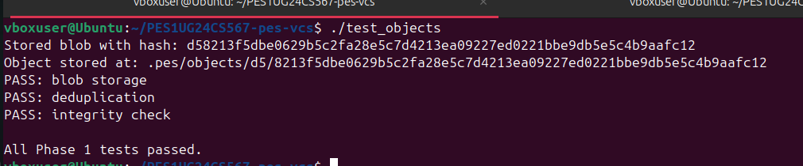
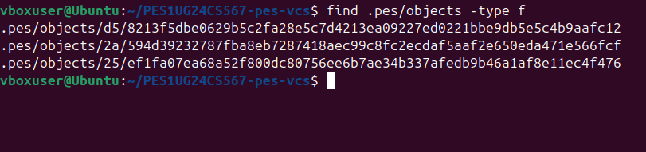
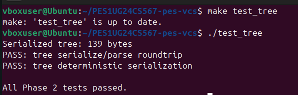
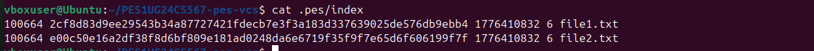
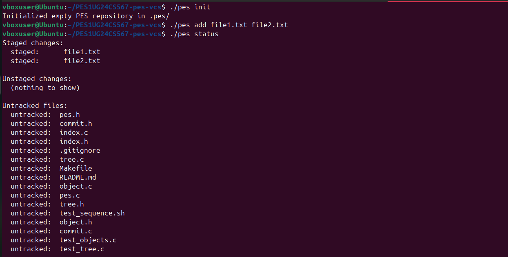
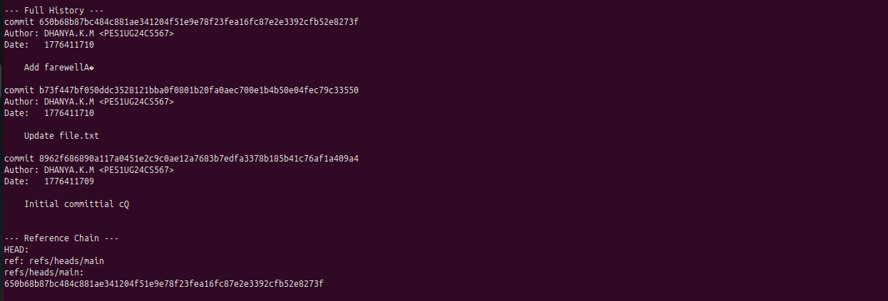
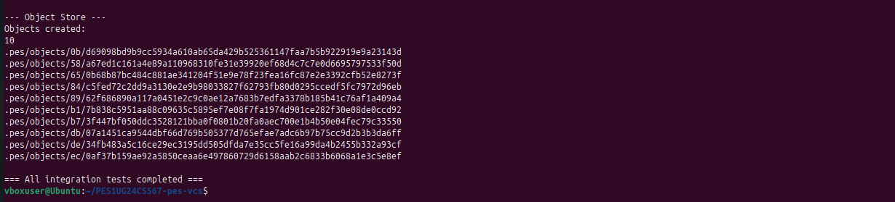
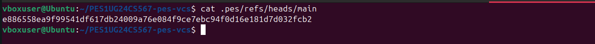

###**Lab Report: Building PES-VCS**###

###**Student Name: Dhanya K.M**###

###**SRN: PES1UG24CS567**###

###**Course: Computer Science (Engineering)**###

###**Platform: Ubuntu 22.04 (VirtualBox)**###
##**1. Project Overview**##

The objective of this lab was to build a simplified Version Control System (VCS) called PES-VCS, modeled after the internal architecture of Git. The project implements content-addressable storage, directory tree serialization, a staging area (index), and commit history management.
##**2. Implementation Details**##
#**Phase 1: Object Storage (object.c)**#

Implemented object_write and object_read. Data is stored by prepending a header (type size\0), hashing the content using SHA-256, and saving it in a sharded directory structure (.pes/objects/XX/YYYY...).

   **Screenshot 1A (Pass):*** 

    **Screenshot 1B (Sharding):** 

#**Phase 2: Tree Objects (tree.c)**#

Implemented tree_from_index and recursive tree construction. This phase handles the mapping of file paths to their respective blob hashes and manages file permissions/modes.

    **Screenshot 2A (Pass):**

    **Screenshot 2B (Hex Dump):**![image] (images/PES1UG24CS567_Phase2B_Hex.png)

#**Phase 3: Staging Area (index.c)**#

Implemented index_load, index_save, and index_add. The index acts as a middleman between the working directory and the next commit, tracking file metadata (mtime, size) to detect changes.

    **Screenshot 3A (Status Check):** 

    **Screenshot 3B (Verification):** 

#**Phase 4: Commits & History (commit.c)**#

Implemented commit_create. This function snapshots the index into a tree, links it to a parent commit, records the author (Dhanya K.M), and updates the branch reference in .pes/refs/heads/main.

    **Screenshot 4A (Log with Author):**

    **Screenshot 4B (Final Success):**

    **Screenshot 4C (Ref Hash):** 

##**3. Analysis Questions**##
#**Phase 5: Branching and Checkout**#

**Q5.1: How would you implement pes checkout <branch>?**
To implement checkout, .pes/HEAD must be updated to point to the new branch reference. The .pes/index must be overwritten with the tree data from that branch's latest commit. Finally, the working directory must be updated by deleting current files and writing the blobs from the target tree back to the disk. This is complex because we must ensure uncommitted local changes are not accidentally overwritten.

**Q5.2: How to detect a "dirty working directory" conflict?**
A conflict is detected by comparing the file in the working directory against the index (using mtime and size). If the file on disk differs from the index, and the file in the index differs from the version in the target branch, the directory is "dirty." The checkout should refuse to proceed to prevent data loss.

**Q5.3: What is a "Detached HEAD" state?**
A Detached HEAD occurs when HEAD points directly to a commit hash instead of a branch reference. Commits made here are "orphaned"—they don't belong to any branch. To recover them, a user must find the commit hash in the log and manually create a new branch pointing to that hash.
##**4. Garbage Collection (GC)**##

**Q6.1: Describe a Reachability Algorithm. I would use a Mark and Sweep algorithm.**
    Mark: Start from all "Roots" (all branch refs in refs/heads/ and HEAD). Recursively traverse all commits, trees, and blobs they point to, marking them as "reachable" in a Hash Set.
    Sweep: Iterate through all files in .pes/objects/. Any file whose hash is not in the "reachable" set is deleted.
    For 100,000 commits, we would need to visit at least every commit once, likely resulting in millions of object visits.

**Q6.2: Why is concurrent GC dangerous?**
If GC runs while a commit is in progress, a race condition occurs. The GC might see a new blob/tree that has been written to disk but not yet linked to a branch ref. The GC would identify it as "unreachable" and delete it. When the commit process finally tries to link that object, the object is gone, causing repository corruption. Git avoids this by using a "grace period" (e.g., 2 weeks) where recently created objects are never deleted.
**5. Conclusion**
This lab successfully demonstrated the core mechanics of a Version Control System. By implementing the object store and the reference chain, I have gained a deep understanding of how Git maintains data integrity and tracks project history through content-addressable sharding.
